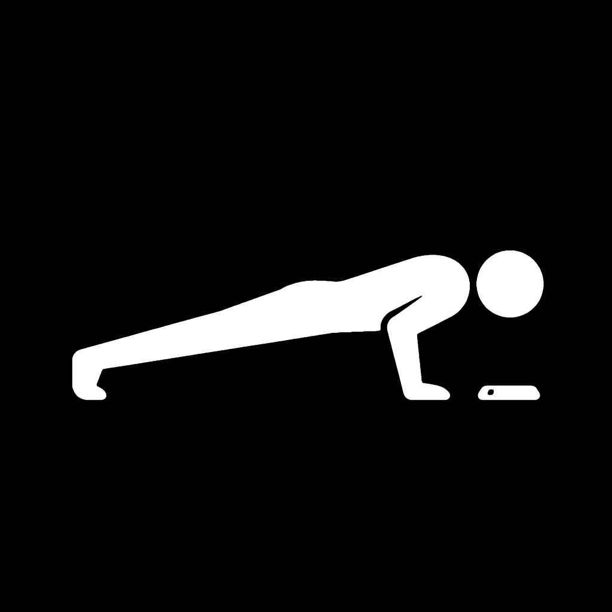

<div align="center">



# DOWNUP

**push-ups, counted by your face.**

no sensors on your body, no manual taps, no server.
place the phone on the floor, get down, and go.

</div>

---

## how it works

DownUp never touches an accelerometer or a tap button to count a rep. Instead:

1. you set the phone face-up on the floor
2. the TrueDepth camera locks onto your face
3. every time your head dips toward the screen and comes back up, that's a rep

The counting logic lives entirely in [`RepCounter`](lib/features/workout/rep_counter.dart) — a small state machine driven by the face-to-camera distance ARKit reports on every frame. It has no idea it's counting push-ups; it just watches a number go down, then up, past two thresholds, with a minimum rep duration to reject noise. That separation is why the counter is unit-tested without a camera, a phone, or a body anywhere near it.

```
        distance
           │
   camera ─┤
           │      ╱‾‾╲          ╱‾‾╲
           │     ╱    ╲        ╱    ╲
     floor ─┴────╱──────╲──────╱──────╲──── time
                 down    up   down    up
                  └── one rep ──┘
```

## what it tracks

Every set logs reps, duration, rest before the set, and per-rep timing — enough to compute averages later without recomputing from raw frames. A streak counter watches for at least one workout a day; miss a day and it resets, same rules as everyone expects from this kind of thing by now.

Want to look at your own numbers instead of trusting a dashboard? The database is a plain SQLite file on your device — `sqflite`, no ORM magic on top.

## your data leaves only if you tell it to

DownUp doesn't have a server. There is no account, no sync, no analytics call fired off in the background. Everything lives in `downface.db` on your phone until you explicitly export it.

Export produces a single `.dfbak` file: your full workout history, AES-256-GCM encrypted. That's not just for privacy — GCM's authentication tag means the app can tell if a single byte of that file changed after you exported it, whether by corruption or by hand. Import checks the tag before touching your database; if it doesn't match, nothing gets written and you get told the file was tampered with. Move the file to a new phone, import it there, done.

```
lib/core/export/backup_codec.dart   — encode/decode + the tamper check
test/backup_codec_test.dart         — proves a flipped byte gets rejected
```

## design

Built entirely on iOS 26's Liquid Glass language: translucent layers, backdrop blur, specular edges, black and white with a user-selectable light/dark theme. No screenshots here — the interface is the screenshot. Run it.

## architecture

Flutter runs headless as the business-logic engine — no `FlutterViewController`, no Flutter widget ever reaches the screen. Every screen is native SwiftUI, talking to the Dart side over a `FlutterMethodChannel`. Dart owns the database, the streak math, the backup codec, and reminder scheduling; Swift owns ARKit face tracking, the UI, HealthKit, and the WidgetKit home-screen widget.

```
lib/
  core/             app state, sqlite layer, streak math, backup codec, reminders
  features/
    workout/        the rep counter + the face-distance stream
ios/Runner/
  FaceTracker.swift        ARKit session, exposed to Dart over a platform channel
  NativeUIBridge.swift     the Dart <-> SwiftUI bridge and app snapshot
  Views/                   every screen: home, workout, stats, settings
ios/DownfaceWidget/
  DownfaceWidget.swift     the home-screen activity widget
```

## running it

```bash
flutter pub get
flutter test        # counter logic, streaks, backup encryption — all offline, no device needed
flutter run         # needs a physical iPhone with a TrueDepth camera; the simulator has no depth sensor
```

TrueDepth means iPhone X or later. There's no fallback path for older hardware — the whole product is the face tracking, so we didn't build a worse version around a tap-to-count button.

## license

MIT. See [LICENSE](LICENSE) — the code is free to use, fork, and build on.

The "DownUp" name and app icon are not covered by that license. Forks and derivative builds should ship under their own name and icon.
