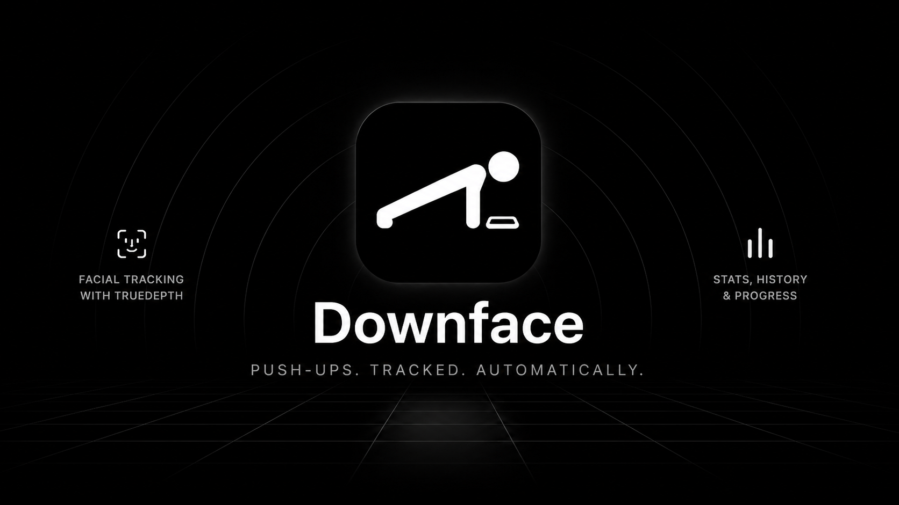

<div align="center">



# DOWNFACE

**push-ups, counted by your face.**

no sensors on your body, no manual taps, no server.
place the phone on the floor, get down, and go.

[](LICENSE)
[](#running-it)
[](#architecture)
[](#architecture)

</div>

---

## contents

- [how it works](#how-it-works)
- [fatigue detection](#fatigue-detection)
- [what it tracks](#what-it-tracks)
- [your data leaves only if you tell it to](#your-data-leaves-only-if-you-tell-it-to)
- [home screen widget](#home-screen-widget)
- [alternate icons](#alternate-icons)
- [design](#design)
- [architecture](#architecture)
- [running it](#running-it)
- [license](#license)

## how it works

Downface never touches an accelerometer or a tap button to count a rep. Instead:

1. you set the phone face-up on the floor
2. the TrueDepth camera locks onto your face
3. every time your head dips toward the screen and comes back up, that's a rep

The counting logic lives entirely in [`RepCounter`](lib/features/workout/rep_counter.dart) — a small state machine driven by the face-to-camera distance ARKit reports on every frame. It has no idea it's counting push-ups; it just watches a number go down, then up, past two thresholds, with a minimum rep duration to reject noise. That separation is why the counter is unit-tested without a camera, a phone, or a body anywhere near it.

```
        distance
           │
   camera ─┤
           │      ╱‾‾╲          ╱‾‾╲
           │     ╱    ╲        ╱    ╲
     floor ─┴────╱──────╲──────╱──────╲──── time
                 down    up   down    up
                  └── one rep ──┘
```

The baseline (what counts as "top of the rep") tracks the highest point reached recently instead of snapping to the last sample — so a rep where you don't fully extend your arms near the end of a set doesn't shrink the amplitude every following rep needs, which used to make the counter silently stall a few reps into a tired set.

## fatigue detection

Downface compares the rolling average of your last few reps against the pace you set at the start of the set. Slow down enough, consistently, and a small message appears near the counter — not a single slow rep triggering a false alarm, and not something that flickers on and off once it fires. It stays until the set ends, dismissible with a tap, never blocking anything on screen.

## what it tracks

Every set logs reps, duration, rest before the set, and per-rep timing — enough to compute averages later without recomputing from raw frames. A streak counter watches for at least one workout a day; miss a day and it resets, same rules as everyone expects from this kind of thing by now.

Tap any day on the activity grid in the stats screen for the full breakdown: set count, reps per set, rest between them, sorted by time — not just a number, the whole session.

Want to look at your own numbers instead of trusting a dashboard? The database is a plain SQLite file on your device — `sqflite`, no ORM magic on top.

## your data leaves only if you tell it to

Downface doesn't have a server. There is no account, no sync, no analytics call fired off in the background. Everything lives in `downface.db` on your phone until you explicitly export it.

Export produces a single `.dfbak` file: your full workout history, AES-256-GCM encrypted. That's not just for privacy — GCM's authentication tag means the app can tell if a single byte of that file changed after you exported it, whether by corruption or by hand. Import checks the tag before touching your database; if it doesn't match, nothing gets written and you get told the file was tampered with. Move the file to a new phone, import it there, done.

```
lib/core/export/backup_codec.dart   — encode/decode + the tamper check
test/backup_codec_test.dart         — proves a flipped byte gets rejected
```

Apple Health sync is opt-in and one-way: Downface writes finished workouts to Health, it never reads anything back.

## home screen widget

A small and medium WidgetKit widget mirrors the activity grid on your home screen — nothing else on it, just the cells, filling the widget edge to edge with proportional insets that scale with widget size. Built against iOS 26's tinted/glass home screen rendering mode from day one, so it doesn't turn into a solid color block when you switch home screen styles.

## alternate icons

Settings → App icon lets you switch between the default icon and two alternates without leaving the app, using `UIApplication.setAlternateIconName` under the hood — no re-download, no re-install.

## design

Built entirely on iOS 26's Liquid Glass language: translucent layers, backdrop blur, specular edges, black and white with a user-selectable light/dark theme. No screenshots here — the interface is the screenshot. Run it.

## architecture

Flutter runs headless as the business-logic engine — no `FlutterViewController`, no Flutter widget ever reaches the screen. Every screen is native SwiftUI, talking to the Dart side over a `FlutterMethodChannel`. Dart owns the database, the streak math, the backup codec, and reminder scheduling; Swift owns ARKit face tracking, the UI, HealthKit, and the WidgetKit home-screen widget.

```
lib/
  core/             app state, sqlite layer, streak math, backup codec, reminders
  features/
    workout/        the rep counter + the face-distance stream
ios/Runner/
  FaceTracker.swift        ARKit session, exposed to Dart over a platform channel
  NativeUIBridge.swift     the Dart <-> SwiftUI bridge and app snapshot
  Views/                   every screen: home, workout, stats, settings
ios/DownfaceWidget/
  DownfaceWidget.swift     the home-screen activity widget
```

Reminders are scheduled through `flutter_local_notifications` with the device's real timezone (not UTC) resolved via `flutter_timezone`, and every notification string — daily nudges, urgent same-day reminders, the midnight streak-loss warning — is translated across all 9 languages the app supports, not just hardcoded English.

## running it

```bash
flutter pub get
flutter test        # counter logic, streaks, backup encryption — all offline, no device needed
flutter run         # needs a physical iPhone with a TrueDepth camera; the simulator has no depth sensor
```

TrueDepth means iPhone X or later. There's no fallback path for older hardware — the whole product is the face tracking, so we didn't build a worse version around a tap-to-count button.

## license

MIT. See [LICENSE](LICENSE) — the code is free to use, fork, and build on.

The "Downface" name and app icon are not covered by that license. Forks and derivative builds should ship under their own name and icon.
